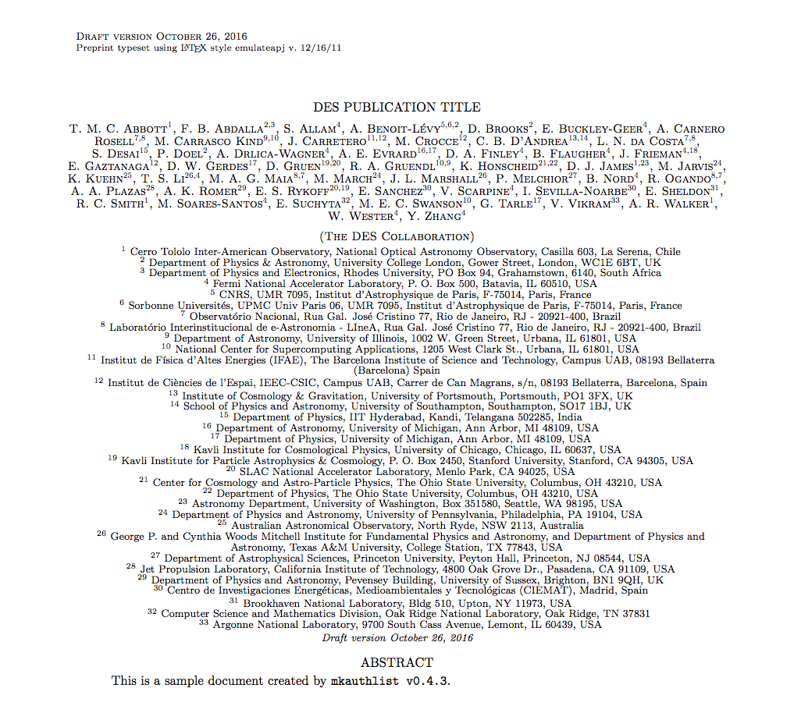

[](https://github.com/DarkEnergySurvey/mkauthlist/actions/workflows/python-package.yml)
[](https://pypi.python.org/pypi/mkauthlist)
[](../../)

mkauthlist
==========

Make long latex author lists from csv files.

Installation
------------

The ``mkauthlist`` script is distributed via ``pip`` and should work on Python 2.7 or later:

```text
> pip install mkauthlist
```

You can also clone the repository and install by hand:

```text
> git clone https://github.com/DarkEnergySurvey/mkauthlist.git
> cd mkauthlist
> python setup.py install
```

Usage
-----

The core usage is to transform a pre-sorted file of comma separated values into an author list suitable for input in the latex. The ``mkauthlist`` script provides several options for more complicated operations when generating the list. To view all the options:

```text
> mkauthlist --help
```

Examples
--------

### General Use

Start with the author list in comma separated value (CSV) format. An example author list file is provided in [data/example_author_list.csv](data/example_author_list.csv) (DES members can see the PubDB system [here](http://dbweb6.fnal.gov:8080/DESPub/app/PB/pub/author_list/DES-2015-0109_author_list.csv?pubid=109)).

```text
> mkauthlist -f --doc -j emulateapj --sort example_author_list.csv example_author_list.tex
> pdflatex example_author_list.tex
```

The output should looks something like this:



### Ordering and Sorting

By default, `mkauthlist` preserves the ordering of the input CSV file. However, it is often necessary to manipulate the order of the author list. While this can be done directly by editing the CSV file,  `mkauthlist` also provides some pre-designed functionality for sorting and ordering author lists.

It is possible to alphabetically sort the entire author list using the `-s, --sort` flag. This was done in the previous example, and is shown again here for clarity:
```
> mkauthlist --sort example_author_list.csv example_author_list.tex
```
Additionally, it is possible to alphabetically sort only the authors identified as "builders" (`JoinedAsBuilder ==  'True'`) using the `-sb, --sort-builder` flag (for DES author lists this is usually already done in the generation of the CSV file). 
```
> mkauthlist --sort-builder example_author_list.csv example_author_list.tex
```
It is often necessary to place a few key authors at the front of the author list. This can be done using an auxiliary author order file (i.e., `--aux order.csv`). Here, `order.csv` is a one-per-line list of author last names (and optionally, first names). Authors with names in `order.csv` will be moved to the front of the author list and placed in the order specified in `order.csv`.
```
> mkauthlist --aux order.csv example_author_list.csv example_author_list.tex
```
It is possible to combine options in order to place several authors first and order the rest of the list alphabetically
```
> mkauthlist --sort --aux order.csv example_author_list.csv example_author_list.tex
```
